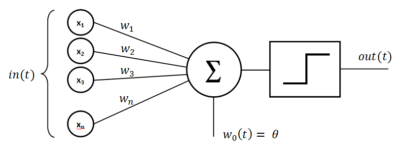

# Perceptron vs Neuron

Both perceptron and neuron are fundamental concepts in neural network theory, but they are not exactly the same. 

### Perceptron

1. **Definition**: A perceptron is a single-layer neural network used for binary classification tasks. It receives multiple input signals, applies weights to them, sums them up, and passes the sum through an activation function to produce an output.

2. **Activation Function**: Typically uses a step function as the activation function, which outputs 1 if the weighted sum of inputs is above a threshold (bias) and 0 otherwise.

3. **Learning Rule**: Uses the perceptron learning rule, also known as the Delta rule or Hebbian learning, to update its weights based on the error in the prediction.

4. **Limitation**: Limited to linearly separable data and cannot solve problems that require non-linear decision boundaries.

### Neuron (Artificial Neuron)

1. **Definition**: A neuron, also known as an artificial neuron or node, is a computational unit in an artificial neural network. It receives one or multiple inputs, applies weights to them, sums them up, and passes the sum through an activation function to produce an output.

2. **Activation Function**: Can use various activation functions like sigmoid, ReLU, tanh, etc., depending on the network architecture and task.

3. **Learning Rule**: Can use various learning algorithms like gradient descent, backpropagation, etc., to update its weights based on the error in the prediction. It's not limited to a specific learning rule like the perceptron.

4. **Flexibility**: Can be part of a single-layer (perceptron) or multi-layer (neural network) structure, allowing it to model complex non-linear relationships.

### Summary

- **Perceptron**: A specific type of neuron used for binary classification with a step activation function and the perceptron learning rule. It's a simplified version of an artificial neuron and is limited to linearly separable problems.

- **Neuron**: A more general computational unit used in artificial neural networks, capable of using various activation functions and learning algorithms. It can be part of both single-layer and multi-layer network architectures, making it more flexible for modeling complex problems.

In essence, a perceptron can be considered a special case or a building block of a more complex artificial neuron used in modern neural network architectures.

### MLP vs MLN

In the context of neural networks, especially in frameworks like scikit-learn that provide implementations of multi-layer perceptrons (MLPs), it's more accurate to refer to them as multi-layer neurons rather than multi-layer perceptrons.

Here's the rationale:

- **Perceptron**: Refers to a single-layer neural network unit that can be used for binary classification. It computes a weighted sum of its inputs and applies an activation function (typically a step function).

- **Neuron**: Refers to a computational unit in an artificial neural network, which can be part of both single-layer and multi-layer network architectures. A neuron computes a weighted sum of its inputs, applies an activation function, and passes the result to the next layer.

- **Multi-layer Perceptron (MLP)**: Refers to a feedforward artificial neural network with one or more hidden layers. Each neuron in an MLP is a multi-layer neuron, capable of handling non-linear relationships and learning complex patterns in the data.

So, when referring to neural networks with multiple layers, it's more appropriate to use the term "multi-layer neurons" or simply "neural networks" rather than "multi-layer perceptrons," as the latter term specifically implies a single-layer structure.